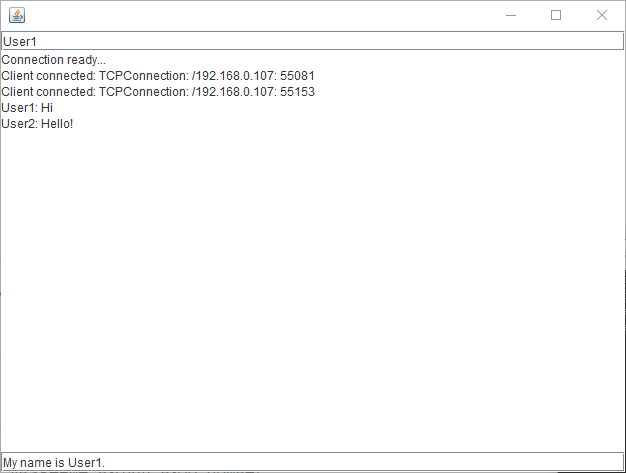
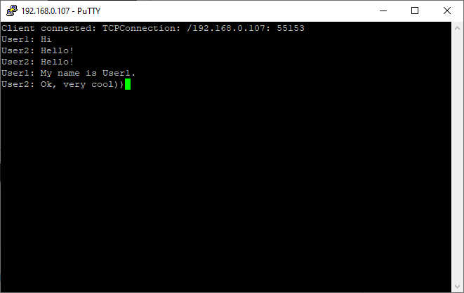

# LocalNetworkChat
Simple implementation of chat for LAN connections. With a Java client and PuTTY connectivity.

A Lan chat app built in Java. Uses created server to provide the ability to send users' messages to each other. 
The desktop aplication can be used in a Local area network to connect users.
Multiple users can chat at the same time.
To use this project, just import the repository and open the project with the IntelliJ Idea.
# App in working
App can be used by Java client and PuTTY.
## Running Java client

## PuTTY connection

Launch the server for chatting. Connect to the server using PuTTY, or run Java client named ClientWindow. Fill in the "Name" field. Enter your message in the text box below. 
The message will be sent to all users who are online and are in the same Local Area Network.

